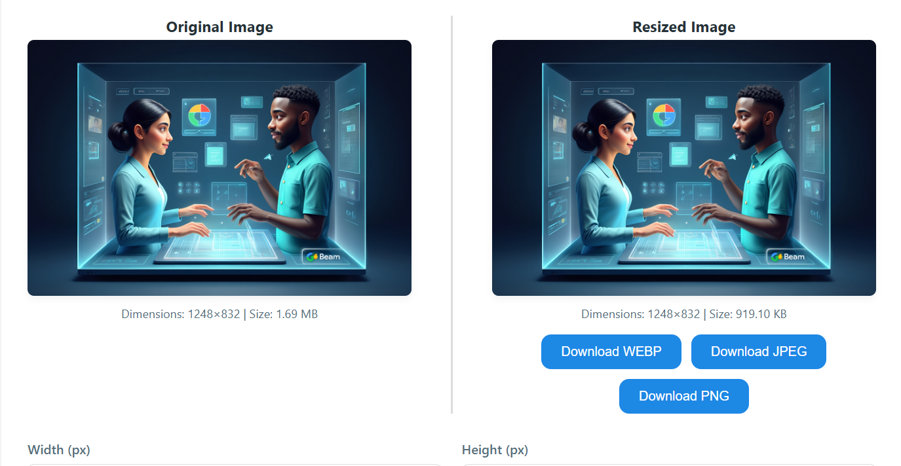

# 🖼️ Image Resizer

Resize, compress, and convert your images effortlessly — all in one place. Perfect for optimizing web performance, social media sharing, or sprucing up digital assets.

<p align="center">
  <a href="https://onlinephotoresizer.netlify.app/" target="_blank">
    
  </a>
</p>

<p align="center">
  <a href="https://www.buymeacoffee.com/rahul.sharma.alx" target="_blank">
    
  </a>
</p>

---

## 🚀 Features

* 🔧 **Resize Images**: Adjust image dimensions with precision.
* 📉 **Compress Files**: Reduce file size for faster loading without quality loss.
* 🔄 **Convert Formats**: Seamlessly switch between JPEG, PNG, and WebP.
* 🌐 **Web-Optimized**: No installation needed — works directly in your browser.
* 🔒 **Privacy First**: Images are processed client-side. Nothing is uploaded.
* ⚡ **Fast & Lightweight**: Built with performance in mind using Vite + React.
* 🧙‍♂️ **Intuitive UI**: Clean interface for a smooth user experience.

---

## 🧭 Live Demo

🔗 [Try it live now](https://onlinephotoresizer.netlify.app/) — no sign-up needed, 100% free!

---

## ⚙️ Getting Started

### 1. Clone the Repository

```bash
git clone https://github.com/rahul-sharma-alx/Image-Resizer.git
cd Image-Resizer
```

### 2. Install Dependencies

```bash
npm install
```

### 3. Start the Development Server

```bash
npm run dev
```

Visit `http://localhost:5173` in your browser to view the app.

---

## 📦 Deployment

This project is built with [Vite](https://vitejs.dev), making it blazing fast and optimized for static hosting.

Deploy in seconds using:

* 🔗 [Netlify](https://www.netlify.com)
* 🔗 [Vercel](https://vercel.com)
* 🔗 GitHub Pages

---

## 🎬 Demo GIF

Coming soon! *(You can create your own using tools like LICEcap or ScreenToGif.)*

---

## 📄 License

This project is licensed under the [MIT License](LICENSE). Feel free to use, modify, and distribute.

---

## 🙌 Contributing

Have an idea to improve the app? Feel free to fork the repo and submit a PR. All contributions are welcome!

1. Fork the repo
2. Create your feature branch: `git checkout -b feature/AmazingFeature`
3. Commit your changes: `git commit -m 'Add some AmazingFeature'`
4. Push to the branch: `git push origin feature/AmazingFeature`
5. Open a pull request

---

## 💡 Inspiration

Designed for creators, web developers, and digital artists who want a quick, private, and easy-to-use image utility.

---

## ✨ Author

Made with ❤️ by [Rahul Sharma](https://github.com/rahul-sharma-alx)

<p align="center">
  <a href="https://www.buymeacoffee.com/rahul.sharma.alx" target="_blank">
    
  </a>
</p>
